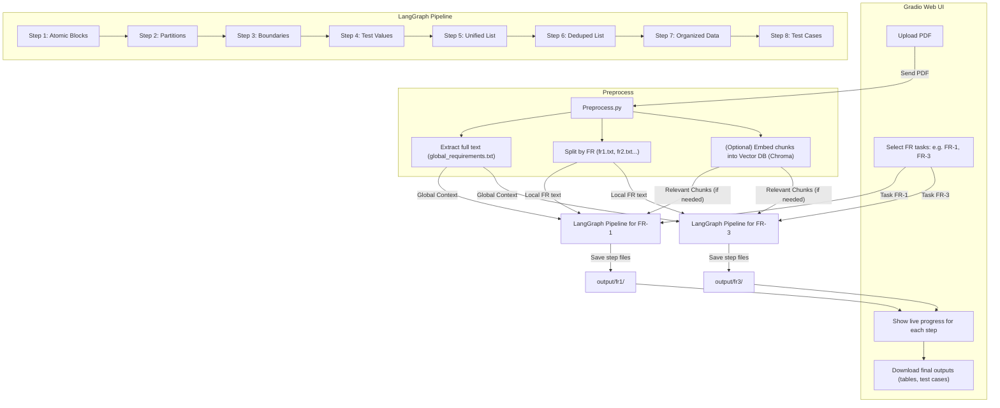

# DECT — Don’t Enjoy Creating Tests?

DECT is a QA automation project that takes functional requirements (PDFs)
and generates test artifacts step by step using LangChain + LangGraph.

---

## 🔹 Goal of the Project

Automate the boring parts of QA test design:

- Break requirements into atomic blocks.
- Generate equivalence partitions & boundary values.
- Produce concrete test data & organized test sets.
- Output executable test cases in Markdown/CSV.

---

## 🔹 Vision / Example

1. upload pdf files to give context to LLM
2. tell it what FR to do "You are tasked to do FR-1 and FR-3"

DECT will produce:

- Atomic breakdown
- Partition tables
- Boundary values
- Concrete test data
- Deduped test list
- Organized equivalence classes
- Final test cases (ready for Jira/TestRail)

---

## 🔹 Tech Stack

- Python 3.13+
- [LangChain](https://python.langchain.com/)
- [LangGraph](https://github.com/langchain-ai/langgraph)
- [Gradio](https://www.gradio.app/) — simple local UI for running steps
- [Ollama](https://ollama.ai/) — local LLM support (planned)
- OpenAI GPT

---

## 🔹 Current State

- [x] PDF preprocessing script
- [ ] LangGraph pipeline (steps 1–8)
- [ ] File outputs by FR/step
- [ ] Example test cases for FR-1

---

## 🔹 Features that be cool to add

- [ ] Jira integration (auto-create tickets)
- [ ] HITL review nodes
- [ ] Retry generating starting from specific steps
