# DECT — Don’t Enjoy Creating Tests?

DECT is a QA automation project that takes functional requirements (PDFs)
and generates test artifacts step by step using LangChain + LangGraph.

---

## 🔹 Goal of the Project

Automate the boring parts of QA test design:

- Break requirements into atomic blocks.
- Generate equivalence partitions & boundary values.
- Produce concrete test data & organized test sets.
- Output executable test cases in Markdown/CSV.

---

## 🔹 Vision / Example

1. upload pdf files to give context to LLM
2. tell it what FR to do "You are tasked to do FR-1 and FR-3"
3. Download CSV of test cases (intended to import in spreadsheetsZ)

DECT will produce:

- Atomic breakdown
- Partition tables
- Boundary values
- Concrete test data
- Deduped test list
- Organized equivalence classes
- Final test cases

```mermaid
---
config:
  layout: dagre
---
flowchart TB
 subgraph s1["Gradio Web UI"]
        n4@{ label: "<span style=\"padding-left:\">1. Process PDF button extracts FR from images<br></span><span style=\"padding-left:\">/data/extractedFR/foo.json<br></span><span style=\"padding-left:\">/data/extractedFR/bar.json</span>" }
        n5["Select which FR to be processed.<br>2. Run button now enabled"]
        n18["Enable Download button<br>Show snippet of final result<br>Show full result"]
        n19["Update pipeline viewer"]
        n1["Upload PDF"]
  end
 subgraph s2["Python Backend / Processing"]
        n2["Convert PDF to imgs<br>"]
        n6@{ label: "for each extractedFR json<br><span style=\"--tw-scale-x:\">/data/extractedFR/*.json</span><br>" }
        n7["Foo.json"]
        n8["Bar.json"]
        n11["FR-1: Only Latin letters. The name must be 2-25 characters."]
        n12@{ label: "<span style=\"padding-left:\">FR-4: The phone number must be 10-12 characters.</span>" }
        n13@{ label: "<span style=\"padding-left:\">FR-2: Only Latin letters. The name must be 2-25 characters.</span>" }
        n9["For each FR"]
        n14["Pipeline<br>Steps 1 - 8"]
        n15["Pipeline<br>Steps 1 - 8"]
        n16["Pipeline<br>Steps 1 - 8"]
        n17["Concatenate all completed FRs"]
        n3["(multimodal image captioning has better accuracy than OCR)"]
        n10@{ label: "Note: currently doesn't do parallel task/batch processing.<br>Right now it only does one FR at a time &gt;.&lt;" }
  end
 subgraph s3["Pipeline"]
        n20["Step 1: Atomic Blocks<br>data/pdf_logbook/foo_pdf/step1.json"]
        n21["Step 2: Partitions"]
        n22["Step 3: Boundaries"]
        n23["Step 4: Test Values"]
        n24["Step 5: Unified List"]
        n25["Step 6: Deduped list"]
        n26["Step 7: Organize Test Data"]
        n27["Step 8: Test Cases"]
  end
 subgraph s4["Step info"]
        n28@{ label: "<span style=\"padding-left:\">Example Input:<br>FR-</span><span style=\"padding-left:\">1: Only Latin letters. The name must be 2–25 characters. If invalid, show error.<br></span><br>atomic_blocks output:<br><span style=\"color:\">id: AB-1, description: Input must contain only Latin letters<br></span><span style=\"color:\">id: AB-2, description: Input must be at least 2 characters long<br>... more AB-*</span>" }
        n29@{ label: "<span style=\"padding-left:\">Example Input:<br>At</span><span style=\"padding-left:\">omic Block AB-1: Only Latin letters<br></span><span style=\"padding-left:\"><br></span><span style=\"padding-left:\">Example Output:<br></span><span style=\"padding-left:\">partitions:<br></span><span style=\"padding-left:\">valid: [Latin letters]<br></span><span style=\"padding-left:\">invalid: [Special characters, Numbers, Non-Latin letters]</span>" }
        n30@{ label: "<span style=\"padding-left:\">Example Input:<br></span><span style=\"padding-left:\">Atomic Block AB-2: Length between 2 and 25 characters<br><br>Example Output:<br>atomic_block_id: AB-2<br><span style=\"padding-left:\">cases: <br></span><span style=\"padding-left:\">{ label: Invalid (&lt;2 chars), example: B }<br></span><span style=\"padding-left:\">{ label: Boundary (2 chars), example: Li }<br></span><span style=\"padding-left:\">{ label: Valid (3–24 chars), example: Alexandra }<br></span>... more cases<span style=\"padding-left:\"></span></span>" }
        n31@{ label: "<span style=\"color:\">Example Input:<br></span>Partitions + Boundaries for AB-1 and AB-2<br><br>Example Output:<br>Test Values:<br><span style=\"padding-left:\">{ atomic_block_id: AB-1, partition_label: Valid, value: Lula }<br></span><span style=\"padding-left:\">  { atomic_block_id: AB-1, partition_label: Invalid, value: !@# }<br>... more test values</span>" }
        n32@{ label: "<span style=\"padding-left:\">Example Input:<br></span><span style=\"padding-left:\">Collected test values from AB-1 and AB-2<br><br>Example Output:<br><span style=\"padding-left:\">values:</span><span style=\"padding-left:\">Lula,</span><span style=\"padding-left:\">!@#,... more values</span></span>" }
        n34@{ label: "<span style=\"padding-left:\">Example Input:<br></span><span style=\"padding-left:\">Lula, !@#, 123, Lula, Alexandra, 123<br><br>Example Output:<br><span style=\"padding-left:\">deduped_values:</span><span style=\"padding-left:\">Lula,</span><span style=\"padding-left:\">!@#,</span><span style=\"padding-left:\">123,</span><span style=\"padding-left:\">Alexandra</span><span style=\"padding-left:\"></span></span>" }
        n35@{ label: "<span style=\"color:\">Example Input:<br></span>Deduped test values + partitions/boundaries<br><br>Example Output:<br><span style=\"padding-left:\">feature: First name field,</span><span style=\"padding-left:\">   <br>equivalence_class: &lt;2 characters (invalid),</span><span style=\"padding-left:\">  <br> boundary_values: [1, 2, 3, 24, 25, 26],<br></span><span style=\"padding-left:\">   test_values_for_class: [B],</span><span style=\"padding-left:\">  <br>test_values_for_boundaries: [B, Li, ...]</span>" }
        n36@{ label: "<span style=\"padding-left:\">Example Input:<br></span><span style=\"padding-left:\">Organized test data<br><br>Example Output:<br>test_cases:<br>{title: Verify the user ...<br>precondition: User is on ...<br>steps: Enter ...<br>... more properties (test_data, expected_result, environment, actual_result, status, jira_bug_link)},<br>{title: foo<br>precondition: bar<br>...}<br><br></span>" }
  end
    n4 -- Task selector now available --> n5
    n5 -- When ran --> n6
    n6 --> n7 & n8
    n7 --> n11 & n12
    n8 --> n13
    n9 --> n12 & n11 & n13
    n12 --> n14
    n11 --> n15
    n13 --> n16
    n14 --> n17
    n15 --> n17
    n16 --> n17 & n19
    n20 --> n21 & n28
    n21 --> n22 & n29
    n22 --> n23 & n30
    n23 --> n24 & n31
    n24 --> n25 & n32
    n25 --> n26 & n34
    n26 --> n27 & n35
    n28 --> n29
    n29 --> n30
    n30 --> n31
    n31 --> n32
    n33["Not true examples.<br>Actual examples are in JSON"] --> s4
    n32 --> n34
    n34 --> n35
    n35 --> n36
    n27 --> n36
    n17 --> n18
    n1 --> n4
    n4 --> n2
    n3 --> n2
    n10 --> n9
    n4@{ shape: rect}
    n18@{ shape: rounded}
    n19@{ shape: rect}
    n1@{ shape: lean-l}
    n6@{ shape: hex}
    n12@{ shape: rect}
    n13@{ shape: rect}
    n9@{ shape: hex}
    n15@{ shape: rect}
    n16@{ shape: rect}
    n17@{ shape: rect}
    n3@{ shape: text}
    n10@{ shape: text}
    n28@{ shape: rect}
    n29@{ shape: rect}
    n30@{ shape: rect}
    n31@{ shape: rect}
    n32@{ shape: rect}
    n34@{ shape: rect}
    n35@{ shape: rect}
    n36@{ shape: rect}
    n33@{ shape: text}
    style n19 fill:#FFE0B2
    style n6 fill:#E1BEE7
    style n7 fill:#E1BEE7
    style n8 fill:#E1BEE7
    style n11 fill:#FFCDD2
    style n12 fill:#FFCDD2
    style n13 fill:#FFCDD2
    style n9 fill:#FFCDD2
    style n14 fill:#FFF9C4
    style n15 fill:#FFF9C4
    style n16 fill:#FFF9C4
    style n17 fill:#FFFFFF
    style n10 color:#D50000,stroke:none
    style s4 fill:#FFE0B2
    style s2 fill:#C8E6C9,stroke:#000000
    style s1 stroke:#000000,fill:#BBDEFB
    style s3 fill:#FFF9C4

```

## 🔹 Install / Setup

> _using UV over pip & assumes on linux_

1. clone repo
2. make venv `uv venv`
3. activate venv `source .venv/bin/activate`
4. install requirements `uv pip install -r requirements.txt`
5. make `.env` file and fill in API cred. (look at `.env.template` for reference)
6. in terminal `python3 app.py`

---

## 🔹 Tech Stack

- Python 3.13+
- [LangChain](https://python.langchain.com/)
- [Gradio](https://www.gradio.app/) — simple local UI for running steps

---

## 🔹 Current State

- [x] PDF preprocessing script
- [x] LangGraph pipeline (steps 1–8)
- [x] File outputs by FR/step
- [ ] verify it works with different providers
  - [x] OpenAI
  - [ ] Ollama
  - [ ] Anthropic
- [ ] Better UX showing processing status

---

## 🔹 Features that be cool to add

- [ ] Stream steps/output and have webui update live
- [ ] Parallel FR processing
- [ ] Jira integration (auto-create tickets)
- [ ] HITL review nodes
- [ ] Retry generating starting from specific steps
